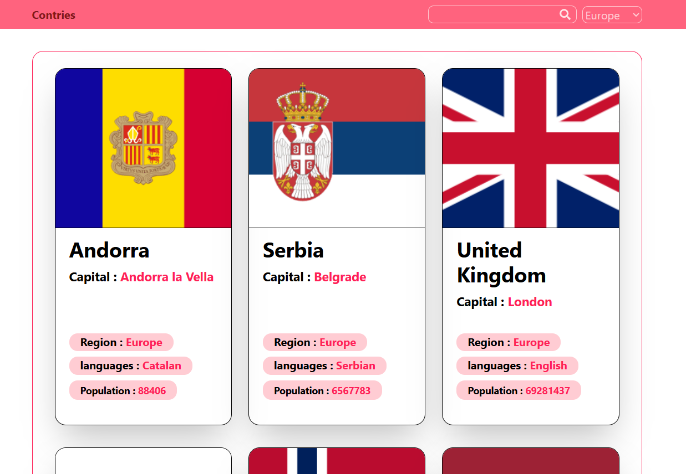
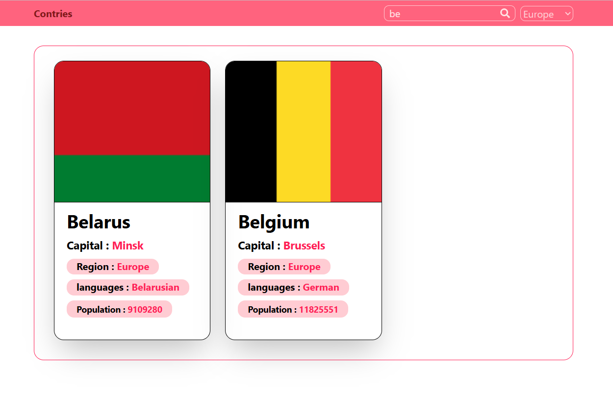

# 🌍 CountryBook - Assignment3 

## 📌 Description
Country Book is a React-based project that displays information about countries around the world.
The application fetches country data from an external API and presents it in a clean, organized format.

## ✨ Features
- Display list of countries
- Show country details such as name, region, population, capital and languages
- Debounced Search capability by name
- Loading and Error Handeling
- Filter by region
- Clean and responsive UI
- Proper use of unique keys in list rendering

## 🛠 Technologies
- React
- Vite
- JavaScript
- CSS / Tailwind CSS
- REST API

## 🔗 API endpoints used
- "https://restcountries.com/v3.1/all?fields=name,capital,region,languages,flags,population"

## ▶️ How to Run the Project
- Navigate to the Folder 
   cd countries-explorer
- Install dependencies
   npm install (i)
- Run the Project
   npm run dev 
   and open the localhost on your browser

## ScreenShots

